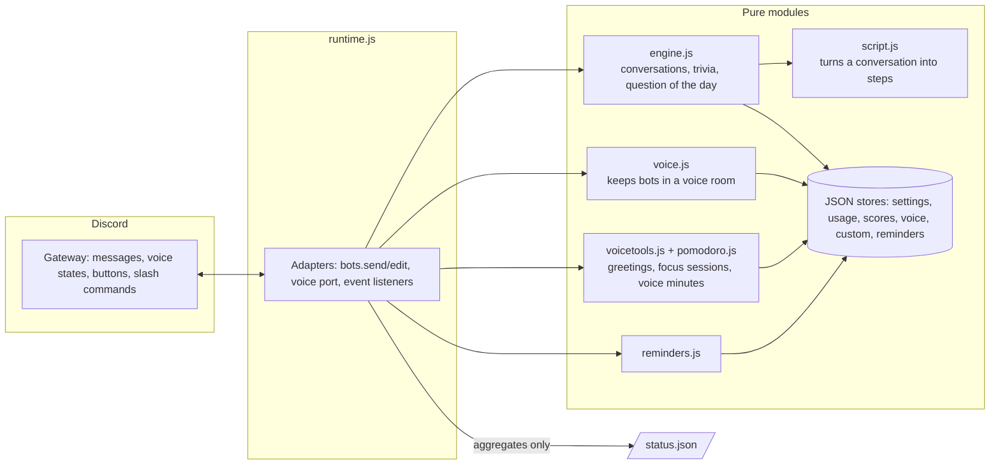

# Architecture

companionsDISCORD runs two to ten Discord bot accounts in one Node process. The design goal: all the interesting behaviour (timing, turn-taking, limits, scoring, reminders) lives in plain modules that never touch Discord, so it can be tested with a fake clock in milliseconds. One file, `src/runtime.js`, is the only place that knows about Discord.

## Ideas that shaped it

**Ports instead of a Discord dependency.** `CompanionEngine` receives `bots` (who can speak, a way to send and edit), a settings store and a content function. `VoiceKeeper` receives a `port` (`candidates`, `isIn`, `join`, `leave`). Tests pass fakes and a fake clock, so "wait 4 minutes, then another bot jumps in" is a test of a few lines.

**Step-back instead of spam.** A conversation is a list of steps with waiting times. Before every step the engine checks whether a person spoke since it started; depending on the step it posts anyway, skips or stops. People always win over bots. Quiet hours, a daily cap and a pause while humans are chatting are checked before a conversation may start.

**Open about being bots.** Every account is a normal bot application with the BOT tag. Nothing impersonates a person.

**No message content.** Only non-privileged intents (`Guilds`, `GuildMessages`, `GuildVoiceStates`). The bots notice that someone wrote, never what. The "new member" welcome uses Discord's own join system message, so it needs no members intent either.

**Personality by token order.** The Nth token is the Nth persona (a ninth persona set wraps for a tenth bot), so a deployment is configured by one comma-separated list.

**Self-healing voice presence.** `VoiceKeeper.tick()` compares what should be true (the saved room and the number of bots) with what is true (is each bot connected and in that channel) and repairs the difference. Failed joins back off 5 s, 15 s, 1 min, then 5 min. A restart restores presence because the room is saved in the settings. Bots show no mute or deafen icon, but never send audio or listen to it.

**Small, honest data.** Plain JSON files with atomic writes (write a temp file, rename). The only user data are Discord ids in the trivia scores, voice minutes and waiting reminders, each erasable by the person (`/trivia forget`, `/voice forget`, reminders are deleted once delivered or cancelled). The status endpoint exposes totals only.

**Content is checked like code.** Fun facts (about 1,250 in each language), trivia (about 300 questions per language, derived from vetted facts) and every spoken line exist in English and Vietnamese, and tests check parity and shape.

## Tests

`npm test` runs on Node's built-in test runner, no extra dependencies. The suites cover the conversation engine with a fake clock, turn-taking rules, trivia scoring, the keeper's backoff and restore behaviour, Pomodoro phases, reminder and event timing, content parity and the status endpoint. They do not replace a live trial in a real server, which is why `/companions now` exists.

## Deployment

One Docker image, one container, a volume for `data/`. On a Raspberry Pi 5 it sits beside a second project (musiDISCORD) in its own folder with its own compose project, and a systemd timer pulls and rebuilds nightly with roll-back if the container does not stay up (`scripts/update.sh`).
